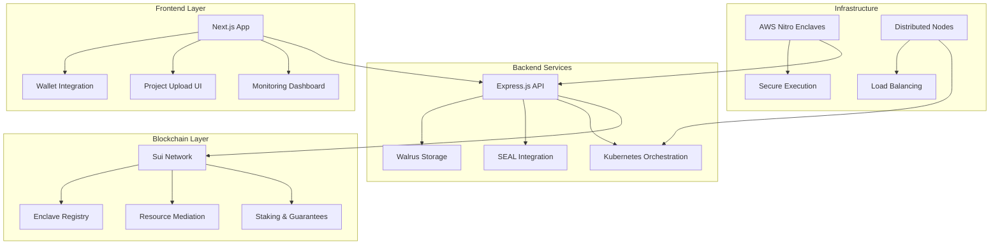

# DaaS-Vader: Decentralized as a Service Platform
## 탈중앙화 서버리스 플랫폼 - Vercel의 편의성과 Web3의 탈중앙화를 결합

---

## 🚀 Project Overview

**DaaS-Vader**는 Web2의 편의성과 Web3의 탈중앙화를 결합한 혁신적인 클라우드 컴퓨팅 플랫폼입니다. Kubernetes 기반으로 구축되어 개발자들에게 Vercel과 같은 편리한 배포 경험을 제공하면서도, 탈중앙화된 인프라를 통해 진정한 소유권과 투명성을 보장합니다.

### 🎯 핵심 가치 제안
- **Vercel-like UX**: 개발자 친화적인 배포 경험
- **Web3 Native**: Sui Network 기반의 온체인 리소스 중재
- **Secure by Design**: AWS Nitro Enclave와 SEAL 기술을 통한 보안
- **Truly Decentralized**: 분산된 노드 네트워크에서 실행

---

## 🏗️ System Architecture

### Core Components



### 📋 Technology Stack

#### Frontend
- **Framework**: Next.js 15.5.3 with React 19
- **Styling**: TailwindCSS 4.0 + Framer Motion
- **Web3**: Mysten dApp Kit for Sui integration
- **UI Components**: Radix UI + Lucide React icons

#### Backend
- **Runtime**: Node.js with TypeScript
- **Framework**: Express.js with comprehensive middleware
- **Storage**: Walrus (decentralized storage)
- **Security**: SEAL + AWS Nitro Enclaves
- **Orchestration**: Kubernetes

#### Blockchain
- **Network**: Sui Network
- **Smart Contracts**: Move language
- **Storage**: Walrus for code/assets
- **Authentication**: Wallet-based authentication

---

## 🔐 Security Architecture

### SEAL (Secure Enclave Application Layer)
DaaS-Vader implements a robust security model using SEAL technology integrated with AWS Nitro Enclaves:

#### Enclave Registry System
```move
public struct EnclaveInfo has key, store {
    id: UID,
    enclave_id: String,
    pcr_values: vector<vector<u8>>,
    public_key: vector<u8>,
    registered_at: u64,
    owner: address,
    status: u8,
    seal_permission_level: u8,
    seal_expires_at: u64,
    allowed_data_types: vector<u8>,
}
```

#### Security Features
- **Hardware-level Isolation**: AWS Nitro Enclaves
- **Attestation**: Cryptographic proof of enclave integrity
- **Access Control**: Role-based permissions for data access
- **Key Management**: Secure key derivation and storage

---

## 🌐 Core Features

### 1. Seamless Project Deployment
- **Git Integration**: Direct repository deployment
- **Automatic Building**: Containerized build process in secure enclaves
- **Environment Management**: Secure secret handling through SEAL

### 2. Wallet-First Authentication
```typescript
// Sui wallet integration with authentication signatures
const generateAuthSignature = async (walletAddress: string): Promise<string> => {
  const timestamp = Date.now()
  const message = `DaaS Authentication\nTimestamp: ${timestamp}\nWallet: ${walletAddress}`

  const signature = await signPersonalMessage({ message })
  return JSON.stringify({ walletAddress, signature, message, timestamp })
}
```

### 3. Decentralized Resource Management
- **On-chain Mediation**: Sui smart contracts manage resource allocation
- **Staking Mechanism**: Economic guarantees from resource providers
- **Load Balancing**: Kubernetes-native traffic distribution

### 4. Real-time Monitoring
- **Build Status**: Live updates on deployment progress
- **Resource Usage**: Comprehensive metrics and logging
- **Performance Analytics**: Application performance insights

---

## 🔄 User Journey

### Developer Experience

1. **Connect Wallet**
   - Support for Suiet and Slush wallets
   - Secure authentication signature generation

2. **Upload Project**
   - GitHub integration or direct file upload
   - Automatic dependency detection
   - Environment variable configuration

3. **Secure Build**
   - Code stored on Walrus decentralized storage
   - Build execution in verified enclaves
   - Cryptographic attestation of build integrity

4. **Deploy & Monitor**
   - Automatic deployment to distributed nodes
   - Real-time monitoring and logging
   - Performance analytics and alerts

### Resource Provider Journey

1. **Enclave Registration**
   - Hardware attestation verification
   - Stake commitment for guarantees
   - Permission level assignment

2. **Resource Provisioning**
   - Kubernetes cluster management
   - Secure workload execution
   - Performance monitoring

3. **Reward Distribution**
   - On-chain payment processing
   - Reputation-based incentives
   - Stake management

---

## 📊 Key Differentiators

### vs Traditional Cloud (AWS, GCP, Azure)
| Feature | Traditional Cloud | DaaS-Vader |
|---------|-------------------|------------|
| **Ownership** | Vendor Lock-in | True User Ownership |
| **Transparency** | Black Box | Open Source + On-chain |
| **Pricing** | Opaque | Transparent Market Pricing |
| **Censorship** | Possible | Censorship Resistant |
| **Data Sovereignty** | Vendor Controlled | User Controlled |

### vs Other Web3 Infrastructure
| Feature | Competitors | DaaS-Vader |
|---------|-------------|------------|
| **Developer UX** | Complex | Vercel-like Simplicity |
| **Security Model** | Basic | Hardware-level (Nitro Enclaves) |
| **Build Process** | Unsecured | Cryptographically Attested |
| **Resource Management** | Limited | Full Kubernetes Integration |

---

## 🛠️ Implementation Status

### ✅ Completed Features
- [x] Sui wallet integration with authentication
- [x] Project upload and file handling system
- [x] SEAL integration with enclave registry
- [x] Walrus storage integration
- [x] Frontend UI with real-time updates
- [x] Smart contract foundation (Move)

### 🚧 In Progress
- [ ] Kubernetes cluster orchestration
- [ ] Build pipeline with enclave execution
- [ ] Comprehensive monitoring dashboard
- [ ] Resource provider onboarding flow

### 📋 Roadmap
- [ ] Multi-region deployment
- [ ] Advanced load balancing
- [ ] Marketplace for resource providers
- [ ] Developer tools and CLI
- [ ] Integration with popular frameworks

---

## 🔬 Technical Deep Dive

### Smart Contract Architecture

#### Enclave Registry (`enclave_registry.move`)
```move
/// Register a new enclave with SEAL permissions
public entry fun register_enclave(
    registry: &mut EnclaveRegistry,
    enclave_id: String,
    pcr_values: vector<vector<u8>>,
    public_key: vector<u8>,
    identity: vector<u8>,
    clock: &Clock,
    ctx: &mut TxContext
)
```

#### Access Control System
- **Permission Levels**: None (0), Basic (1), Advanced (2), Admin (3)
- **Data Types**: Secrets, Config, Logs, Public
- **Time-based Expiration**: Automatic permission revocation

### API Architecture

#### Project Upload Endpoint
```typescript
// Secure project upload with wallet authentication
app.post('/api/projects/upload',
  authenticateWallet,
  upload.single('project'),
  async (req, res) => {
    // Process and store on Walrus
    // Generate build attestation
    // Deploy to enclave
  }
)
```

### Frontend Architecture

#### Wallet Provider Integration
```typescript
// App-wide wallet context
<QueryClientProvider client={queryClient}>
  <SuiClientProvider networks={networkConfig} defaultNetwork="devnet">
    <WalletProvider
      autoConnect={false}
      preferredWallets={['Slush Wallet', 'Suiet']}
      requiredFeatures={['sui:signAndExecuteTransactionBlock']}
    >
      {children}
    </WalletProvider>
  </SuiClientProvider>
</QueryClientProvider>
```

---

## 💡 Innovation Highlights

### 1. Hardware-Secured Builds
- First platform to use AWS Nitro Enclaves for code builds
- Cryptographic proof of build integrity
- Tamper-proof execution environment

### 2. Seamless Web3 Integration
- Wallet-first authentication without compromising UX
- On-chain resource mediation with off-chain execution
- Transparent pricing and resource allocation

### 3. True Decentralization
- No single point of failure
- Community-operated infrastructure
- Open-source and transparent

### 4. Developer-Centric Design
- Familiar deployment workflows
- Comprehensive tooling and monitoring
- Extensive documentation and support

---

## 🌟 Business Model

### Revenue Streams
1. **Platform Fees**: Small percentage on resource usage
2. **Premium Features**: Advanced monitoring, priority support
3. **Enterprise Solutions**: Custom deployments, SLA guarantees
4. **Developer Tools**: CLI, integrations, advanced analytics

### Market Opportunity
- **TAM**: $100B+ cloud infrastructure market
- **SAM**: $10B+ serverless and PaaS market
- **SOM**: $1B+ developer-focused infrastructure

---

## 🚀 Getting Started

### Prerequisites
```bash
# Install dependencies
npm install

# Set up environment
cp .env.example .env
```

### Development Setup
```bash
# Frontend
cd project-root/frontend
npm run dev

# Backend
cd project-root/backend
npm run dev

# Smart Contracts
cd contracts
sui move build
```

### Production Deployment
```bash
# Build and deploy
npm run build
docker build -t daas-vader .
kubectl apply -f k8s/
```

---

## 🤝 Community & Contribution

### Open Source Commitment
- **License**: MIT
- **Governance**: Community-driven development
- **Transparency**: All development in public

### Contribution Guidelines
- Fork the repository
- Create feature branches
- Submit pull requests with comprehensive tests
- Follow coding standards and documentation

### Community Channels
- **GitHub**: Issues, discussions, and contributions
- **Discord**: Real-time community support
- **Twitter**: Updates and announcements
- **Blog**: Technical deep-dives and tutorials

---

## 📈 Metrics & KPIs

### Platform Metrics
- **Projects Deployed**: Real-time deployment count
- **Active Developers**: Monthly active users
- **Resource Utilization**: Infrastructure efficiency
- **Build Success Rate**: Platform reliability

### Business Metrics
- **Revenue Growth**: Platform fee collection
- **Node Network**: Resource provider growth
- **Developer Retention**: User engagement
- **Enterprise Adoption**: B2B customer acquisition

---

## 🔮 Future Vision

### Short Term (3-6 months)
- Production-ready platform launch
- Initial developer community building
- Basic resource provider network
- Core feature completeness

### Medium Term (6-12 months)
- Multi-region infrastructure
- Advanced developer tools
- Enterprise partnerships
- Expanded blockchain integrations

### Long Term (1-2 years)
- Industry-standard adoption
- Global infrastructure network
- Advanced AI/ML workload support
- Cross-chain interoperability

---

## 📞 Contact & Links

### Project Links
- **GitHub**: [github.com/DAAS-Vader](https://github.com/DAAS-Vader)
- **Documentation**: [docs.daas-vader.com](https://docs.daas-vader.com)
- **Demo**: [demo.daas-vader.com](https://demo.daas-vader.com)

### Team
- **Technical Lead**: Blockchain & Infrastructure Expert
- **Product Manager**: Web3 UX Specialist
- **Security Engineer**: Enclave & Cryptography Expert
- **DevOps Engineer**: Kubernetes & Cloud Native Expert

---

*DaaS-Vader: Where Web2 meets Web3, delivering the future of decentralized cloud computing.*

**Built with ❤️ by the DaaS-Vader team**